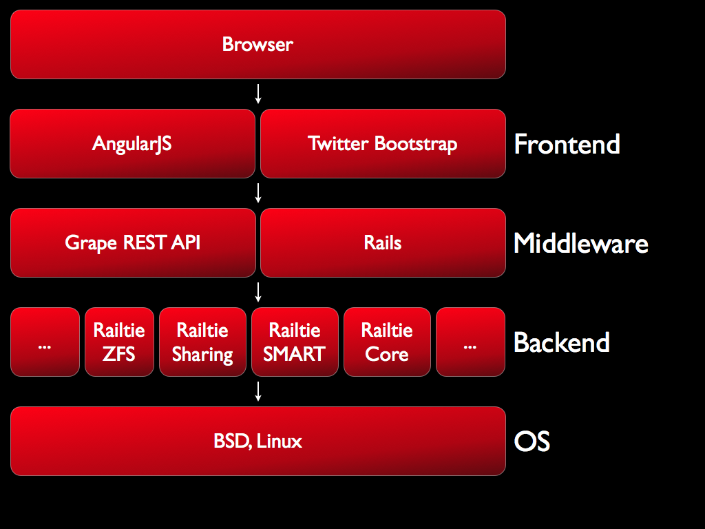

# RubyNAS

The story of a new NAS system...

## Dream

I always had the dream of server at home which is an unobtrusive hub for most of my digital activities. Newer days those servers are called NAS (the short for network attached storage).

If you have the money you can go to a local shop or amazon to buy a pretty good system already. There are pretty good systems from QNAP and Synology, EMC2 and more. They all have big feature lists and proprietary software.

I really like the idea, that one should be able to extend your NAS or home server. And those systems sometimes give you the power to do so. Actually this is not so easy. The steps to produce and maintain a package is quite high. Most of the times the influence you can have on the GUI is very limited. You can define a list of keys and allowed values to configure your extension.

FreeNAS is a FreeBSD based distribution that should help with that, since it is open/free and extensible. Unfortunately they choose technologies like python/django, that makes it hard to contribute for a ruby developer. One other thing, that is very important to me, is a modern file system, in other words ZFS. Most proprietary vendors lack support for this.

I think it is time for a new approch to the free and open NAS world. One that follows a clean and nice structure and that makes it easy to contribute from the get go. Based on proven technologies and ideas it should really be possible to create a community around your home server.

## Architecture - The Master Plan

As with everything: making a plan makes sense. The master plan for this project is an architecture easy to understand and to extend. So what is the foundation for that? The base should be a *inx system. So something like FreeBSD and Ubuntu Server. I really like both distributions. And since Ubuntu has support for ZFS I feel comfortable to start from a Ubuntu. Ubuntu is also easy to learn and understand therefore contributing should be easy. Since I like to support FreeBSD also the operating system should be covered by an extra layer.

Since a NAS system is mainly defined by its services, apps and configurations that are accessed using a nice and clean UI, this is one of the central parts of RubyNAS.

The following Picture will illustrate the layers involved:

The base is a rails application with its railties or rails engines as the basic plugin system. Grape is used to create restful api's that can be used by AngularJS to create a rich and modern user experience. Twitter bootstrap will help to create a consistent look and feel accross the application while minimizing the need to write custom css to fix browser based problems. The Railties are really a key part to the system, they will take care of the operating system abstraction. Since each railtie is able to implement support for the services on multiple operating systems, you can use the system that you like to run your NAS.

## Deployment

The deployment should be simple and therefore is based on the package management system of the distribution it is running on. In other words to install RubyNAS on an Ubuntu system the dpkg system with deb files will be used etc..

To make the deployment easy there is a main project called **rubynas** that will include the other depending parts using the `Gemfile`. The rubynas package can than be produced with a simple:

	make debian

This will create a single deployable debian package with all its dependencies ready to be installed.

## Open 

This system is meant to be open and easy to contribute to. So feel free to:

* Make translations
* Create documentation for users
* Fix bugs
* Create new railties for new services, apps and configurations
* Create packages and distributions of the system

## License

The whole official part of the project will use the MIT License, enabling commercial extensions and use.
